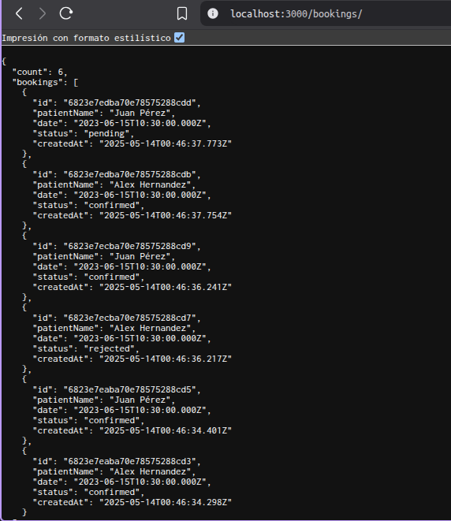
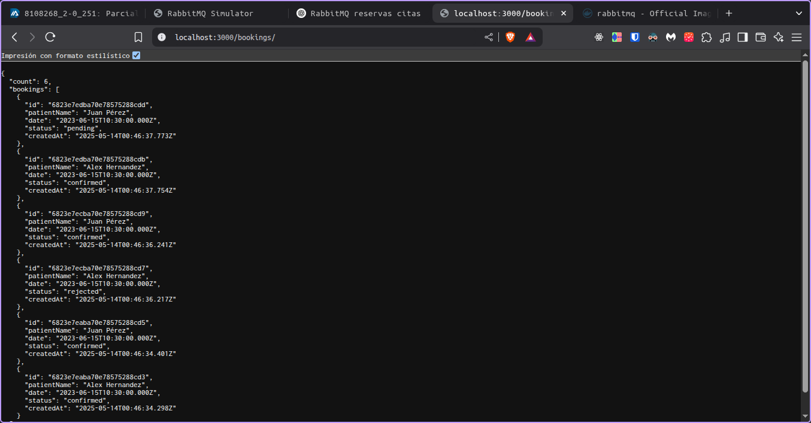
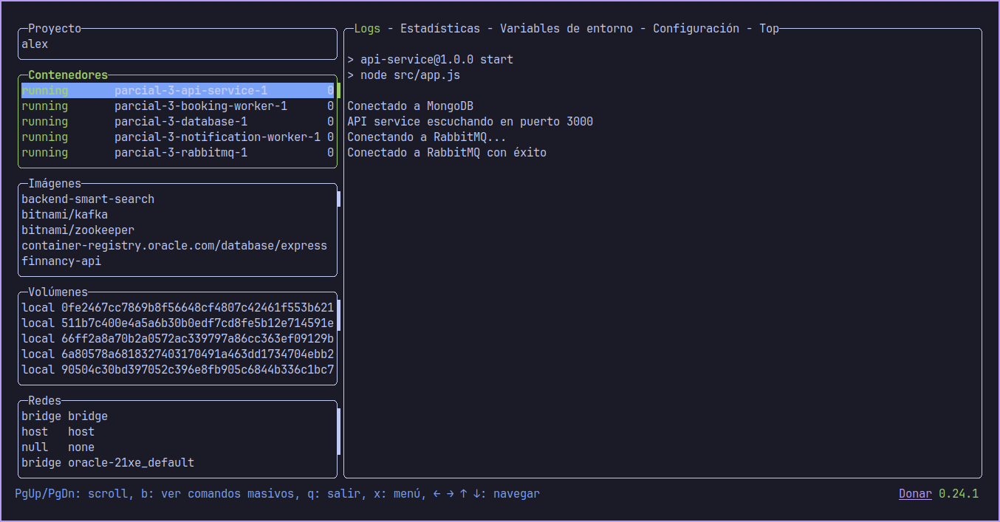

Alex Hernandez
# Sistema de reservas para clínica médica online

Sistema para gestionar citas médicas con procesamiento asíncrono y notificaciones. Usa RabbitMQ para la comunicación entre servicios.

## Componentes del sistema

API REST: Node.js + Express + MongoDB
Workers: Procesamiento de citas + Notificaciones
RabbitMQ: Colas de trabajo y pub/sub
MongoDB: Almacenamiento de citas



## API Endpoints

POST /book: Crear reserva nueva (datos paciente + horario)
GET /booking/{id}: Consultar estado (pending/confirmed/rejected)
GET /bookings: Ver todas las reservas

## Colas y workers

El worker de procesamiento agarra las citas de la cola booking_requests, simula la confirmación con un delay de 2-5 segundos, y actualiza el estado en la BD. Si hay errores, reintenta máximo 3 veces.

El worker de notificaciones escucha del exchange booking_notifications y simula enviar un email al paciente.

## Decisiones de diseño

MongoDB: Elegido por su facilidad de integración y esquema flexible.
Exchange fanout: Para notificaciones porque simplifica añadir nuevos servicios de notificación.
Mensajes durables: Garantizan que no se pierdan reservas si se cae RabbitMQ.
Cola de reintentos: Con TTL de 10s cuando falla el procesamiento.

Los workers tienen restart: always en Docker para que se reinicien si se caen. Los mensajes usan ack manual para garantizar procesamiento.

## Ejecutar el sistema

```
docker-compose up -d
```

Escalar workers:
```
docker-compose up -d --scale booking-worker=3
```

## Pruebas

Crear reserva:
```
curl -X POST http://localhost:3000/book -H "Content-Type: application/json" -d '{"patientName":"Juan Pérez","patientEmail":"juan@example.com","date":"2023-06-15T10:30:00Z"}'
```

Ver todas las reservas:
```
curl http://localhost:3000/bookings
```

Ver estado de una reserva:
```
curl http://localhost:3000/booking/{id}
```

## Logs

Booking worker:


Notification worker:


API service:
